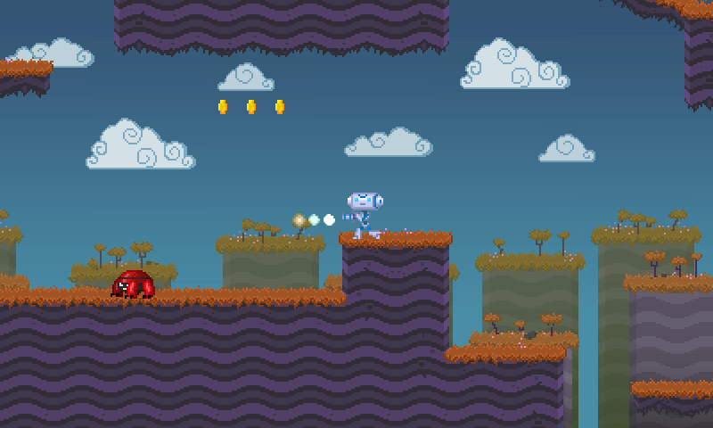

# Millie 2D Platformer Game Project

Control Scheme 1 : 

A / D = Left / Right

J = Shoot

K = Jump (can double jump)

L = Dash (can perform in air). Cooldown 1 second

---

Control Scheme 2 : 

Left Arrow / Right Arrow = Left / Right

Z = Shoot

X = Jump (can double jump)

C = Dash (can perform in air). Cooldown 1 second

Language: GDScript

Renderer: GLES 2

## Screenshots

